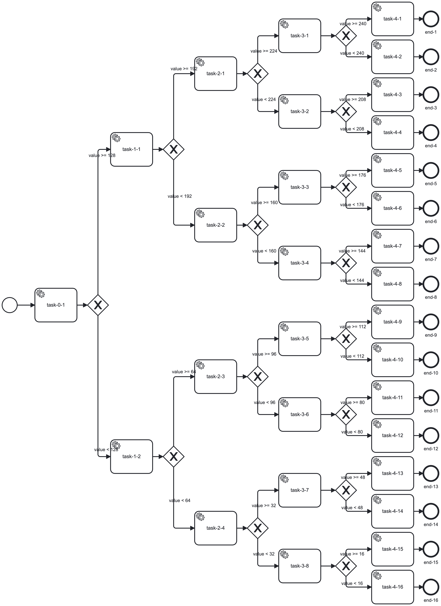

Test Suite for Performance Measurements
=======================================

## Work in Progress

## Documentation

The main idea is to measure the execution speed of a single process/workflow.
Also, when doing so, the cluster performance can be monitored.

The `Random-Tree-Workflow` BPMN was build with the idea, that different input variables will result in different results (end-state),
but having the same amount of elements processed (per each run).
This means, the involved service task handler must just complete a given job.

Some test results are posted here: https://forum.pbinitiative.org/t/gobpm-architecture/46/9?u=nitram509
